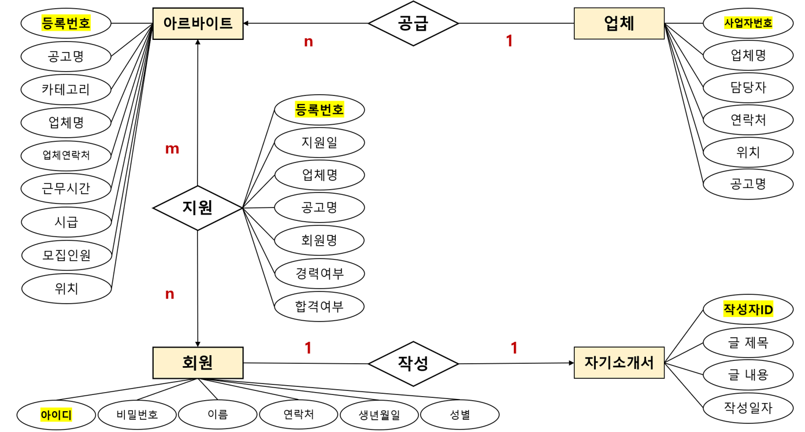

# 2022 DataBase Team Project

## 1. 프로젝트 계획

### 소개

일대일, 일대다, 다대다 관계가 성립하는 데이터베이스를 만들고, 이를 웹사이트로 구현한다. 

고용주는 아르바이트 구직을 올리고, 고용인은 아르바이트를 선택하여 지원하는 웹사이트를 구현한다.

 

### 구성원

C093299 홍민기 [PM]

C089080 이현정

C089081 임재희

 

### 엔티티 관계

- **1 : 1 관계 (일대일 관계**) : 상대 엔티티와 반드시 단 하나의 관계를 가진다. `회원~자기소개서`

- **1 : N 관계 (일대다 관계)**: 한쪽이 여러 개의 객체를 가질 수 있다. `업체~아르바이트`
- **N : M 관계 (다대다 관계)**: 양쪽이 모두 1 : N의 관계를 가진다. `회원~아르바이트`

 

## 2. 설계

### E-R 다이어그램

